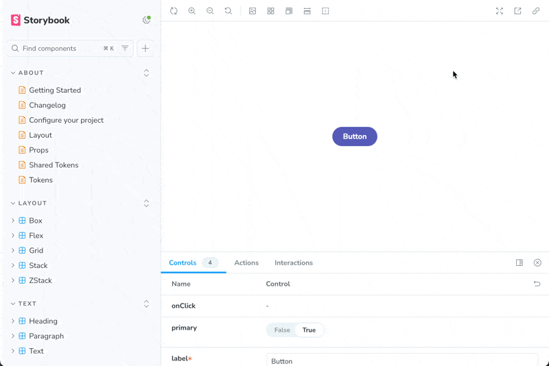

# Storybook Panel Bug

## Problem

When viewing a story page, if you navigate directly to the page or refresh the
story you will notice that the Addons panel below the story will be visible if
it was previously hidden. This is causing the whole page to be pushed up by
`40px`. The `shortcuts` button in the sidebar and the toolbar above the story
become inaccessible.

This seems to only be a problem when you have a more than `53` stories and you
are viewing the `54+` story and do a refresh.

## How to Replicate

1. `yarn storybook`
2. Navigate to [example-button--primary](http://localhost:6006/?path=/story/example-button--primary)
3. This only happens on initial page load, so refresh the page

If you navigate to [example-button--docs](http://localhost:6006/?path=/docs/example-button--docs)
and then click on Example/Button/Primary button in the sidebar you'll notice the bug is not there
anymore.
